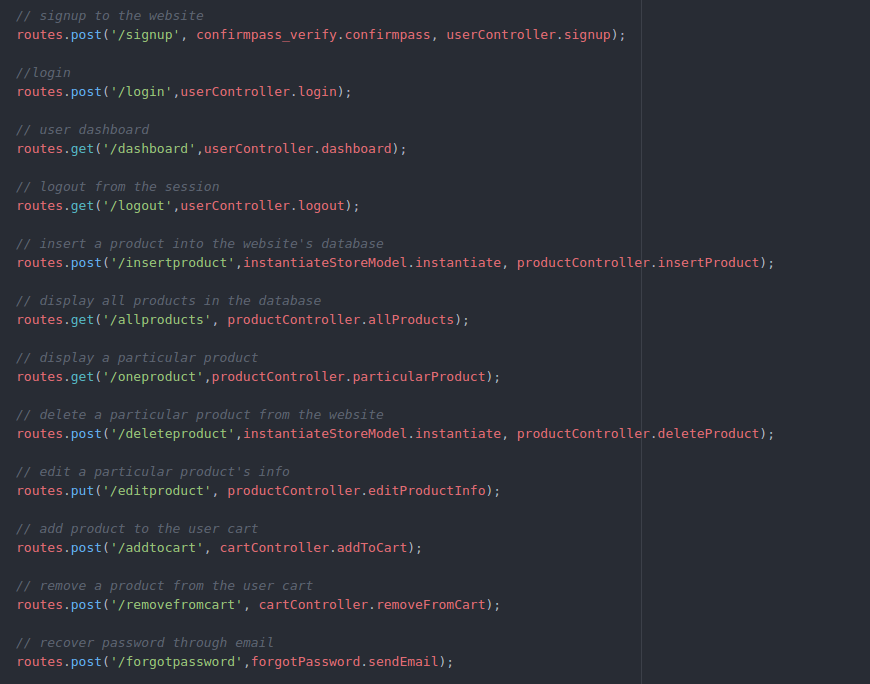

# Ecommerce-website-RestApi
A Restful Api for an Ecommerce website
###### Note: This Api is developed for educational purposes and not for production environment. It teaches how a RestApi is implemented and how it functions to accomplish some basic web operations.

<div align="center">
  <a href="#">
    
  </a>
  <a href="https://nodejs.org/en/about/">
    
  </a>
  <a href="http://mongoosejs.com/docs/guide.html">
    
  </a>
</div>  
 
## Getting Started
Before we begin with dissecting the Api, we need to install some modules. In order to install the necessary modules, navigate into the project directory and type the following command: `npm install`. This command installs all the dependencies listed in package.json file into node_modules directory.

some key takeaways from this resource are:  
- Basic CRUD operations
- Json Web Token(JWT) authentication
- Implementing cookies
- writing middleware
- maintaining structured output

## How to use the API  
There are 12 routes in total that performs different operations which defines how an ecommerce website works.  




### User Management:
##### 1. API to Signup  
In postman type in the following URL for a post request:  
`http://localhost:3000/api/signup`  
send a JSON object through body parameter. It looks something like this:
```
{
	"firstname":"your-firstname",
	"lastname":"your-lastname",
	"email":"your-email",
	"password":"set-new-password",
	"confirmpass":"re-enter-password",
	"phone":"your-phone-number"
}
```
This post request creates a Document in mongodb with an additional _id attribute
```
{
	"_id" : ObjectId("5a83dfbccce1a21f74b9a9f9"),
	"cart" : [ ],
	"firstname" : "your-firstname",
	"lastname" : "your-lastname",
	"password" : "your-password",
	"confirmpass" : "your-password",
	"email" : "your-email",
	"phone" : "your-phone-number",
	"__v" : 5
}

```
**Note:** Additional attribute `_id` generated for the above mongodb document is a unique identification number that is unique for every json object. This is auto-generated by the mongodb and is used to perform further operations of this Api.

##### 2. API to Login
In postman type in the following URL for a post request:  
`http://localhost:3000/api/login`  
send a JSON object through body parameter. It looks something like this:  
```
{
	"email":"your-registered-email",
	"password":"your-registered-password"
}
```
If the credentials are correct then the output will be as follows:
```
{
    "error": false,
    "message": "successfully logged in",
    "user_email": "your-email",
    "status": 200,
    "data": {
        "name": "your-fullname"
    }
}
```
If the credentials are incorrect then the output will be:
```
{
    "error": true,
    "message": "wrong username/password",
    "status": 500,
    "data": null
}
```
##### 3. API to logout
In postman type in the following URL for a post request:  
`http://localhost:3000/api/logout`  
cookies will be cleared and will be successfully logged out.  
output looks something like this:  
```
{
    "error": false,
    "message": "successfully logged out",
    "status": 200,
    "data": null
}
```
##### 4. API to recover forgotton password  
post request, url `http://localhost:3000/api/forgotpassword?email=[your-registered-email]`  
If the email exists then a password recovery email will be sent to your mail-id.  
But if the email doesn't exist then the following output is sent:
```
{
    "error": true,
    "message": "No account is associated with this email. Try again",
    "status": 200,
    "data": null
}
```
**NOTE:** As I dont have a mail server, I've used ethereal's mail server to perform this operation. ethereal.email doesn't actually send email to the original email address but it is meant just for testing purposes. To know more about [ethereal.email](https://ethereal.email/).  
To check whether the mail's been sent login to ethereal account with the following credentials:  
```
user: rcwkybo22n7vfqiv@ethereal.email
password: T7rDp5egTezqN1czM3
```

### Product Management:
##### 1. Inserting a product into the database
post request, url `http://localhost:3000/api/insertproduct`  
post with the product data through body parameters. consider this sample data:  
```
{
	"name":"asus zenfone 2 laser",
	"category":"electronics",
	"subcategory":"mobiles",
	"details":{
		"specs":["16gb ROM","2gb RAM","13MP rear camera","5MP front camera"],
		"price":"9.999"
	}
}
```
##### 2. Display all the products in the database  
get request, url `http://localhost:3000/api/allproducts`  
Displays all the products in the database. Every product has **category** and **subcategory** attributes for the classification.  

##### 3. Display a particular product    
post request, url `http://localhost:3000/api/oneproduct?id=[_id-of-the-product]`  
Displays a particular product from the database.  

##### 4. Edit product
put request, url `http://localhost:3000/api/editproduct?id=[_id-of-the-product]`  
Pass the data editing details through body parameters. consider the example below.  
send this through body parameters:
```
{
	"details":{
		"specs":["5.5 inch display"]
	}
}
```
item in the above specs array will be added to the already created product. i.e., product is appended.  
output looks like this:  
```
{
    "error": false,
    "message": "product info updated successfully",
    "status": 200,
    "data": {
        "details": {
            "specs": [
                "16gb ROM","2gb RAM",
                "13MP rear camera",
                "5MP front camera",
                "5.5 inch display"
            ],
            "price": "9.999"
        },
        "_id": "5a83dbc71858111d2ca34abb",
        "name": "asus zenfone 2 laser",
        "category": "electronics",
        "subcategory": "mobiles",
        "__v": 1
    }
}
```
##### 5. Delete a product  
post request, url `http://localhost:3000/api/deleteproduct?id=[_id-of-the-product]`  
particular product will be deleted from productmodels collection.  

##### 6. Add product to cart  
post request, url `http://localhost:3000/api/addtocart?product_id=[_id-of-the-product]`  
product will be added to the cart array of the usermodels collection.  
check using the following mongodb console command: `db.usermodels.find().pretty()`

##### 7. Remove from cart  
post request, url `http://localhost:3000/api/removefromcart?product_id=[_id-of-the-product]`  
product will be removed from the cart.  

**NOTE:** both `add to cart` and `remove from cart` has **product_id** as query parameter attribute instead of **id** like in the previous routes.  


